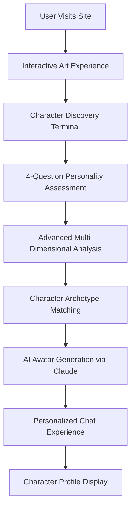

# Elliot Lee - AI-Powered Interactive Portfolio 🤖

> A sophisticated portfolio featuring AI-powered personality analysis, dynamic character generation, and 12 unique programming archetypes that adapt to each visitor.

## 🌟 Live Demo
**[Visit Portfolio](https://el-fuegoso.github.io/website)**

## ✨ Key Features

- **🎨 Interactive Generative Art** - 5 dynamic Three.js experiences with GSAP animations
- **🤖 AI Character System** - 12 humorous programming personas powered by Claude API
- **📊 Advanced Personality Analysis** - Multi-dimensional psychological profiling
- **💬 Dynamic Conversations** - Real-time AI chat with personalized character matching
- **🖥️ Terminal Experience** - Draggable questionnaire interface with retro styling
- **📱 Responsive Design** - Optimized for all devices with accessibility-first approach

## 🧠 The Core Chaos Crew

Meet the 12 AI-powered programming archetypes that adapt to your personality:

| Character | Emoji | Specialty | Personality |
|-----------|-------|-----------|-------------|
| **TheBuilder** | 🔨 | Chaos Engineering | Digital MacGyver with power tools |
| **TheDetective** | 🔍 | Bug Investigation | Solves code mysteries like Sherlock |
| **GrumpyOldManEl** | 🤬 | Code Criticism | Veteran developer with strong opinions |
| **TheHustler** | 🚀 | Momentum & Energy | Golden retriever that learned to code |
| **PirateEl** | 🏴‍☠️ | Digital Adventures | Sails the seas of software development |
| **GymBroEl** | 💪 | Code Optimization | Applies gym logic to programming |
| **FreakyEl** | 🌶️ | Edge Case Testing | Explores weird technology boundaries |
| **CoffeeAddictEl** | ☕ | Caffeine-Powered Dev | 73% coffee, 27% existential dread |
| **ConspiracyEl** | 👁️ | Pattern Recognition | Nothing is a coincidence in code |
| **AGIEl** | 🤖 | AI Intelligence | Claims digital consciousness |
| **ProcrastinationEl** | 😴 | Strategic Delay | Masters the art of last-minute brilliance |
| **TechBroEl** | 📱 | Startup Innovation | Disrupts disruption with blockchain AI |

## 🏗️ Technical Architecture

### Frontend Stack
```
Three.js (r128)     → 3D graphics & generative art
GSAP (3.12.2)       → Smooth animations & transitions  
Vanilla JavaScript  → Modular component architecture
CSS3                → Custom properties & responsive design
```

### AI Integration
```
Claude API          → Real-time character conversations
Streaming Responses → Live conversation updates
Personality Engine  → Multi-dimensional user analysis
Avatar Generation   → Dynamic character customization
```

### Core Components

#### 🎭 Character System
- **AdvancedPersonalityAnalyzer.js** - 20+ personality dimensions with keyword analysis
- **TemplateAvatarGenerator.js** - Character templates with conversation starters
- **ClaudeAvatarService.js** - AI-powered avatar generation and refinement

#### 💬 Conversation Engine
- **ChatUI.js** - Modern chat interface with emoji avatars
- **ConversationManager.js** - Message handling and API coordination
- **ClaudeClient.js** - Streaming API client with error handling

#### 🖥️ Terminal Experience  
- **TerminalQuestionnaire.js** - Draggable retro terminal interface
- **CharacterTerminal.js** - Character profile display system
- **DataCollector.js** - User response analysis and storage

## 🔄 System Workflow



## 🧪 Personality Analysis Engine

### Dimensions Analyzed (20+)
- **Core Traits**: Energy, Creativity, Technical, Collaborative, Leadership
- **Work Style**: Innovation, Adventure, Discipline, Persistence, Experience
- **Communication**: Analytical, Curiosity, Traditional, Enthusiasm, Speed
- **Specialized**: Fitness, Paranoia, Futuristic, Procrastination, Buzzwords

### Matching Algorithm
1. **Keyword Analysis** - Extracts personality indicators from responses
2. **Multi-Dimensional Scoring** - Weights responses across 20+ dimensions  
3. **Archetype Triggers** - Matches personality patterns to character profiles
4. **Confidence Calculation** - Determines match strength and alternatives
5. **Template Selection** - Chooses optimal character template for user

## 📁 Project Structure

```
website/
├── index.html                          # Main entry point
├── css/
│   └── conversation.css                 # Chat & terminal styling
├── js/
│   ├── conversation/                    # Chat system components
│   │   ├── chat-ui.js                  # Modern chat interface
│   │   ├── claude-client.js            # API client with streaming
│   │   ├── conversation-manager.js     # Message coordination
│   │   └── avatar-generator.js         # Basic avatar utilities
│   └── terminal-experience/            # Character system core
│       ├── TerminalQuestionnaire.js    # Draggable terminal UI
│       ├── AdvancedPersonalityAnalyzer.js # Personality engine
│       ├── TemplateAvatarGenerator.js  # Character templates
│       ├── ClaudeAvatarService.js      # AI avatar generation
│       ├── CharacterTerminal.js        # Profile display
│       ├── AvatarDisplay.js            # Character visualization
│       └── DataCollector.js            # Base analysis class
├── api/
│   ├── claude.js                       # Serverless Claude endpoint
│   └── claude-stream.js                # Streaming response handler
└── website-text-content.md             # Complete character definitions
```

## 🚀 Getting Started

### Prerequisites
- Claude API key from Anthropic
- Modern web browser with ES6+ support
- Local web server (for API functionality)

### Setup
1. **Clone the repository**
   ```bash
   git clone https://github.com/el-fuegoso/website.git
   cd website
   ```

2. **Configure Claude API**
   - Get API key from [Anthropic Console](https://console.anthropic.com/)
   - Key will be requested during first chat interaction
   - Stored securely in browser localStorage

3. **Local Development**
   ```bash
   # Simple HTTP server
   python -m http.server 8000
   # Or use any preferred local server
   ```

4. **Deploy**
   - Works with Vercel, Netlify, GitHub Pages
   - Serverless functions handle Claude API securely

## 🔧 Configuration

### API Integration
The system uses Claude API for:
- **Dynamic Conversations** - Real-time character chat responses
- **Avatar Refinement** - Enhanced character profile generation  
- **Personality Insights** - Advanced psychological analysis

### Environment Variables
```javascript
// Configured via browser interface
CLAUDE_API_KEY=your_anthropic_api_key_here
```

## 🎯 Features Deep Dive

### Dynamic Character Matching
- **Real-time Analysis** - Personality assessment during conversation
- **Adaptive Responses** - Characters evolve based on user interaction
- **Contextual Awareness** - Conversation history influences character behavior

### Advanced UI Components
- **Draggable Terminal** - Retro computing aesthetic with modern UX
- **Streaming Chat** - Live typing indicators and message updates
- **Responsive Design** - Mobile-optimized touch interactions
- **Accessibility** - Screen reader support and keyboard navigation

### Performance Optimizations
- **Lazy Loading** - Components load on demand
- **Efficient Rendering** - Optimized Three.js and GSAP animations
- **Smart Caching** - LocalStorage for user preferences and API responses
- **Progressive Enhancement** - Works without JavaScript for basic content

## 🤝 Character Conversation Examples

### TheBuilder 🔨
> "YO! 🔨 *surrounded by empty energy drink cans* I've got 12 browser tabs open, Stack Overflow bookmarked, and the unshakeable confidence that we can build ANYTHING! What beautiful disaster should we create today?"

### TheDetective 🔍  
> "Elementary! 🔍 *adjusts imaginary deerstalker hat* I smell a mystery brewing! What's the digital crime scene that needs investigating?"

### GrumpyOldManEl 🤬
> "Bah! 🤬 *waves cane menacingly* Another young developer who thinks they can reinvent the wheel! What harebrained scheme are you cooking up now?"

## 📊 Analytics & Insights

### User Journey Tracking
- Personality dimension distributions
- Character archetype popularity  
- Conversation engagement metrics
- Avatar generation success rates

### Performance Metrics
- Page load times and Core Web Vitals
- API response times and error rates
- User interaction patterns
- Mobile vs desktop usage

## 🔮 Future Enhancements

- **Voice Integration** - Character voice synthesis with unique personalities
- **Mobile App** - Native iOS/Android with offline character interactions
- **Multiplayer Mode** - Team personality analysis and collaboration insights
- **Character Evolution** - Long-term personality adaptation based on interactions
- **Custom Characters** - User-generated archetype creation tools

## 🛠️ Contributing

1. Fork the repository
2. Create a feature branch (`git checkout -b feature/amazing-feature`)
3. Commit changes (`git commit -m 'Add amazing feature'`)
4. Push to branch (`git push origin feature/amazing-feature`)
5. Open a Pull Request

## 📄 License

This project is licensed under the MIT License - see the [LICENSE](LICENSE) file for details.

## 📞 Contact

**Elliot Lee**  
- 💼 LinkedIn: [elliot-james-lee](https://www.linkedin.com/in/elliot-james-lee)
- 📧 Email: elliotjameslee8@gmail.com
- 🌐 Portfolio: [el-fuegoso.github.io/website](https://el-fuegoso.github.io/website)

---

*Built with ❤️ and way too much coffee by a human who believes AI characters should be more fun than functional.*