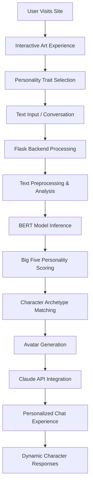

# Elliot Lee - AI-Powered Interactive Portfolio 🤖

> A sophisticated portfolio featuring AI-powered personality analysis, dynamic character generation, and 12 unique programming archetypes that adapt to each visitor.

## 🌟 Live Demo
**[Visit Portfolio](https://el-fuegoso.github.io/website)**

## ✨ Key Features

- **🎨 Interactive Generative Art** - 5 dynamic Three.js experiences with GSAP animations
- **🤖 AI Character System** - 12 humorous programming personas powered by Claude API
- **📊 Advanced Personality Analysis** - Multi-dimensional psychological profiling
- **💬 Dynamic Conversations** - Real-time AI chat with personalized character matching
- **🖥️ Terminal Experience** - Draggable questionnaire interface with retro styling
- **📱 Responsive Design** - Optimized for all devices with accessibility-first approach

## 🧠 The Core Chaos Crew

Meet the 12 AI-powered programming archetypes that adapt to your personality:

| Character | Emoji | Specialty | Personality |
|-----------|-------|-----------|-------------|
| **TheBuilder** | 🔨 | Chaos Engineering | Digital MacGyver with power tools |
| **TheDetective** | 🔍 | Bug Investigation | Solves code mysteries like Sherlock |
| **GrumpyOldManEl** | 🤬 | Code Criticism | Veteran developer with strong opinions |
| **TheHustler** | 🚀 | Momentum & Energy | Golden retriever that learned to code |
| **PirateEl** | 🏴‍☠️ | Digital Adventures | Sails the seas of software development |
| **GymBroEl** | 💪 | Code Optimization | Applies gym logic to programming |
| **FreakyEl** | 🌶️ | Edge Case Testing | Explores weird technology boundaries |
| **CoffeeAddictEl** | ☕ | Caffeine-Powered Dev | 73% coffee, 27% existential dread |
| **ConspiracyEl** | 👁️ | Pattern Recognition | Nothing is a coincidence in code |
| **AGIEl** | 🤖 | AI Intelligence | Claims digital consciousness |
| **ProcrastinationEl** | 😴 | Strategic Delay | Masters the art of last-minute brilliance |
| **TechBroEl** | 📱 | Startup Innovation | Disrupts disruption with blockchain AI |

## 🏗️ Technical Architecture

### Frontend Stack
```
Three.js (r128)     → 3D graphics & generative art
GSAP (3.12.2)       → Smooth animations & transitions  
Vanilla JavaScript  → Modular component architecture
CSS3                → Custom properties & responsive design
```

### Backend Stack  
```
Flask (Python)      → RESTful API for personality analysis
PyTorch/Transformers → Machine learning model inference
BERT/RoBERTa        → Language model for text analysis
Gunicorn            → Production WSGI server
Big Five Framework  → Psychological personality model
```

### AI Integration
```
Claude API          → Real-time character conversations
Streaming Responses → Live conversation updates
Personality Engine  → Multi-dimensional user analysis
Avatar Generation   → Dynamic character customization
ML Models           → BERT-based personality trait extraction
```

### Core Components

#### 🎭 Character System
- **AdvancedPersonalityAnalyzer.js** - 20+ personality dimensions with keyword analysis
- **TemplateAvatarGenerator.js** - Character templates with conversation starters
- **ClaudeAvatarService.js** - AI-powered avatar generation and refinement

#### 💬 Conversation Engine
- **ChatUI.js** - Modern chat interface with emoji avatars
- **ConversationManager.js** - Message handling and API coordination
- **ClaudeClient.js** - Streaming API client with error handling

#### 🖥️ Frontend Experience  
- **main.js** - Core application logic and orchestration
- **ocean-personality.js** - OCEAN personality framework implementation
- **trait-selector.js** - Interactive personality trait selection interface

#### 🧠 Backend Personality Engine
- **analyzer.py** - Core personality analysis with Big Five framework
- **model_loader.py** - Machine learning model loading and inference
- **preprocessing.py** - Advanced text preprocessing and feature extraction
- **utils.py** - Avatar generation and personality trait utilities
- **character_data.py** - Character archetype definitions and mappings

## 🔄 System Workflow


```mermaid
graph TD
    A[User Visits Site] --> B[Interactive Art Experience]
    B --> C[Personality Trait Selection]
    C --> D[Text Input / Conversation]
    D --> E[Flask Backend Processing]
    E --> F[Text Preprocessing & Analysis]
    F --> G[BERT Model Inference]
    G --> H[Big Five Personality Scoring]
    H --> I[Character Archetype Matching]
    I --> J[Avatar Generation]
    J --> K[Claude API Integration]
    K --> L[Personalized Chat Experience]
    L --> M[Dynamic Character Responses]
```

## 🧪 Personality Analysis Engine

### Dimensions Analyzed (20+)
- **Core Traits**: Energy, Creativity, Technical, Collaborative, Leadership
- **Work Style**: Innovation, Adventure, Discipline, Persistence, Experience
- **Communication**: Analytical, Curiosity, Traditional, Enthusiasm, Speed
- **Specialized**: Fitness, Paranoia, Futuristic, Procrastination, Buzzwords

### Matching Algorithm
1. **Keyword Analysis** - Extracts personality indicators from responses
2. **Multi-Dimensional Scoring** - Weights responses across 20+ dimensions  
3. **Archetype Triggers** - Matches personality patterns to character profiles
4. **Confidence Calculation** - Determines match strength and alternatives
5. **Template Selection** - Chooses optimal character template for user

## 📁 Project Structure

```
website/
├── index.html                          # Main entry point
├── vercel.json                         # Vercel deployment configuration
├── website-text-content.md             # Complete character definitions
├── CLAUDE.md                           # Development guidelines
├── 
├── Frontend/
├── css/                                # Stylesheets
│   ├── main.css                        # Core styling
│   ├── conversation.css                # Chat interface styling
│   ├── avatar-cards.css                # Character card styling
│   └── trait-selector.css              # Personality selector UI
├── js/                                 # JavaScript modules
│   ├── main.js                         # Main application logic
│   ├── ocean-personality.js            # OCEAN personality framework
│   ├── trait-selector.js               # Personality trait selection
│   └── conversation/                   # Chat system components
│       ├── chat-ui.js                  # Modern chat interface
│       ├── claude-client.js            # API client with streaming
│       ├── conversation-manager.js     # Message coordination
│       └── avatar-generator.js         # Avatar generation utilities
├── api/                                # Serverless API endpoints
│   ├── claude.js                       # Main Claude API endpoint
│   ├── claude-stream.js                # Streaming responses
│   └── chat.js                         # Chat functionality
├── images/                             # Static assets & project galleries
│   ├── 121-festival/                   # Festival project screenshots
│   ├── blackbird/                      # Blackbird project images
│   ├── daobot/                         # DAO bot visuals
│   ├── drama/                          # Drama project assets
│   ├── eliza/                          # ELIZA chatbot images
│   ├── kaiawhina/                      # Kaiawhina project
│   ├── talent-army/                    # Talent Army screenshots
│   └── vipassana/                      # Vipassana app images
├──
├── Backend - Python/Flask API/
├── backend/                            # Flask personality analysis API
│   ├── app.py                          # Main Flask application
│   ├── requirements.txt                # Python dependencies
│   ├── requirements_training.txt       # ML training dependencies
│   ├── gunicorn.conf.py               # Production server config
│   ├── start_server.sh                # Server startup script
│   ├── personality_analyzer/           # Core analysis package
│   │   ├── __init__.py
│   │   ├── analyzer.py                 # Main personality analyzer
│   │   ├── preprocessing.py            # Text preprocessing
│   │   ├── model_loader.py             # ML model loading
│   │   ├── utils.py                    # Utilities & avatar generation
│   │   ├── character_data.py           # Character archetype data
│   │   └── claude_chat.py              # Claude integration
│   ├── models/                         # ML model storage
│   │   ├── ocean_analyzer.py           # OCEAN model implementation
│   │   └── ocean_model/                # Trained model files
│   │       ├── config.json
│   │       ├── pytorch_model.bin
│   │       └── tokenizer files...
│   ├── data/                           # Training datasets
│   │   ├── essays_big5_dataset.csv     # Big Five essay dataset
│   │   ├── synthetic_dataset.csv       # Generated training data
│   │   └── dataset statistics...
│   ├── utils/                          # Backend utilities
│   │   └── terminal_processor.py       # Terminal text processing
│   ├── logs/                           # Training & server logs
│   ├── Training & Development/
│   ├── train_model.py                  # ML model training script
│   ├── run_training.py                 # Training execution
│   ├── prepare_dataset.py              # Data preparation
│   ├── training_config.yaml            # Training configuration
│   ├── test_analyzer.py                # Analyzer tests
│   ├── test_essays_big5.py            # Dataset validation
│   ├── Personality_Training_Colab.ipynb # Jupyter training notebook
│   ├── TRAINING_README.md              # Training documentation
│   ├── CLOUD_TRAINING_GUIDE.md         # Cloud training setup
│   └── venv/                           # Python virtual environment
```

## 🚀 Getting Started

### Prerequisites
- **Frontend**: Modern web browser with ES6+ support
- **Backend**: Python 3.8+, pip, virtual environment
- **APIs**: Claude API key from Anthropic
- **Development**: Local web server for development

### Complete Setup

#### 1. Clone the Repository
```bash
git clone https://github.com/el-fuegoso/website.git
cd website
```

#### 2. Backend Setup (Python/Flask)
```bash
# Navigate to backend directory
cd backend

# Create and activate virtual environment
python -m venv venv
source venv/bin/activate  # On Windows: venv\Scripts\activate

# Install dependencies
pip install -r requirements.txt

# Test the personality analyzer
python test_analyzer.py

# Start the Flask development server
python app.py
```
The backend server will be available at `http://localhost:5000`

#### 3. Frontend Setup
```bash
# Return to project root (if in backend directory)
cd ..

# Start a local web server
python -m http.server 8000
# Or use Node.js: npx serve .
# Or use any preferred local server
```
The frontend will be available at `http://localhost:8000`

#### 4. Configure Claude API
- Get your API key from [Anthropic Console](https://console.anthropic.com/)
- Key will be requested during first chat interaction
- Stored securely in browser localStorage

#### 5. Verify Integration
1. Visit `http://localhost:8000` for the frontend
2. Ensure `http://localhost:5000` shows backend health check
3. Test personality analysis through the interface
4. Verify Claude chat functionality

### Production Deployment

#### Frontend Deployment
- **Vercel**: Automatic deployment via Git hooks
- **Netlify**: Serverless functions handle Claude API
- **GitHub Pages**: Static hosting with external API

#### Backend Deployment
```bash
# Install production dependencies
pip install gunicorn

# Start production server
gunicorn --config gunicorn.conf.py app:app

# Or use the provided startup script
./start_server.sh
```

### Development Workflow
1. **Backend Development**: Run Flask in development mode (`python app.py`)
2. **Frontend Development**: Use local web server with hot reloading
3. **API Testing**: Backend provides test endpoints at `http://localhost:5000`
4. **Model Training**: Use provided Jupyter notebooks and training scripts

## 🔧 Configuration

### API Integration
The system uses Claude API for:
- **Dynamic Conversations** - Real-time character chat responses
- **Avatar Refinement** - Enhanced character profile generation  
- **Personality Insights** - Advanced psychological analysis

### Environment Variables
```javascript
// Frontend - Configured via browser interface
CLAUDE_API_KEY=your_anthropic_api_key_here

// Backend - Python environment
FLASK_ENV=development
FLASK_DEBUG=True
MODEL_PATH=./models/ocean_model/
```

## 🔌 API Documentation

### Backend API Endpoints

The Flask backend provides comprehensive personality analysis capabilities:

#### Health Check
```http
GET /
```
Returns server status and analyzer readiness.

#### Text Analysis
```http
POST /api/analyze
Content-Type: application/json

{
  "text": "Your text to analyze for personality insights...",
  "mode": "general|quest|conversation|jd",
  "context": [optional conversation history]
}
```

#### Quest Mode Analysis
```http
POST /api/quest
Content-Type: application/json

{
  "responses": ["response1", "response2", "response3", "response4"],
  "user_name": "UserName"
}
```

#### Avatar Generation
```http
POST /api/generate_avatar
Content-Type: application/json

{
  "personality_scores": {
    "Openness": 0.7,
    "Conscientiousness": 0.6,
    "Extraversion": 0.8,
    "Agreeableness": 0.5,
    "Neuroticism": 0.3
  },
  "user_context": {}
}
```

### Frontend API Integration

The frontend integrates with both backend personality analysis and Claude API:

```javascript
// Personality Analysis
const personalityResult = await fetch('/api/analyze', {
    method: 'POST',
    headers: { 'Content-Type': 'application/json' },
    body: JSON.stringify({ text: userInput, mode: 'general' })
});

// Claude Chat Integration
const chatResponse = await fetch('/api/claude-stream', {
    method: 'POST',
    headers: { 'Content-Type': 'application/json' },
    body: JSON.stringify({ 
        message: userMessage,
        character: selectedCharacter,
        personality: personalityScores
    })
});
```

### Response Format

All backend endpoints return structured JSON responses:

```json
{
  "status": "success|error",
  "personality_scores": {
    "Openness": {
      "score": 0.7,
      "level": "High",
      "description": "Curious, imaginative, open to new experiences",
      "confidence": 0.8,
      "percentile": 70.0
    }
    // ... additional Big Five traits
  },
  "avatar_data": {
    "title": "Your Personal El: The Innovator",
    "archetype": {
      "name": "The Innovator",
      "description": "Creative and organized, brings novel ideas to life",
      "emoji": "💡"
    },
    "dominant_traits": ["Creative", "Organized"],
    "working_style": {
      "structure": "Prefers structured approaches",
      "innovation": "Enjoys exploring new methods",
      "energy": "Works best with collaboration"
    }
  },
  "explanation": "Based on your input analysis..."
}
```

## 🎯 Features Deep Dive

### Dynamic Character Matching
- **Real-time Analysis** - Personality assessment during conversation
- **Adaptive Responses** - Characters evolve based on user interaction
- **Contextual Awareness** - Conversation history influences character behavior

### Advanced UI Components
- **Draggable Terminal** - Retro computing aesthetic with modern UX
- **Streaming Chat** - Live typing indicators and message updates
- **Responsive Design** - Mobile-optimized touch interactions
- **Accessibility** - Screen reader support and keyboard navigation

### Performance Optimizations
- **Lazy Loading** - Components load on demand
- **Efficient Rendering** - Optimized Three.js and GSAP animations
- **Smart Caching** - LocalStorage for user preferences and API responses
- **Progressive Enhancement** - Works without JavaScript for basic content

## 🤝 Character Conversation Examples

### TheBuilder 🔨
> "YO! 🔨 *surrounded by empty energy drink cans* I've got 12 browser tabs open, Stack Overflow bookmarked, and the unshakeable confidence that we can build ANYTHING! What beautiful disaster should we create today?"

### TheDetective 🔍  
> "Elementary! 🔍 *adjusts imaginary deerstalker hat* I smell a mystery brewing! What's the digital crime scene that needs investigating?"

### GrumpyOldManEl 🤬
> "Bah! 🤬 *waves cane menacingly* Another young developer who thinks they can reinvent the wheel! What harebrained scheme are you cooking up now?"

## 📊 Analytics & Insights

### User Journey Tracking
- Personality dimension distributions
- Character archetype popularity  
- Conversation engagement metrics
- Avatar generation success rates

### Performance Metrics
- Page load times and Core Web Vitals
- API response times and error rates
- User interaction patterns
- Mobile vs desktop usage

## 🔮 Future Enhancements

- **Voice Integration** - Character voice synthesis with unique personalities
- **Mobile App** - Native iOS/Android with offline character interactions
- **Multiplayer Mode** - Team personality analysis and collaboration insights
- **Character Evolution** - Long-term personality adaptation based on interactions
- **Custom Characters** - User-generated archetype creation tools

## 🛠️ Contributing

1. Fork the repository
2. Create a feature branch (`git checkout -b feature/amazing-feature`)
3. Commit changes (`git commit -m 'Add amazing feature'`)
4. Push to branch (`git push origin feature/amazing-feature`)
5. Open a Pull Request

## 📄 License

This project is licensed under the MIT License - see the [LICENSE](LICENSE) file for details.

## 📞 Contact

**Elliot Lee**  
- 💼 LinkedIn: [elliot-james-lee](https://www.linkedin.com/in/elliot-james-lee)
- 📧 Email: elliotjameslee8@gmail.com
- 🌐 Portfolio: [el-fuegoso.github.io/website](https://el-fuegoso.github.io/website)

---

*Built with ❤️ and way too much coffee by a human who believes AI characters should be more fun than functional.*