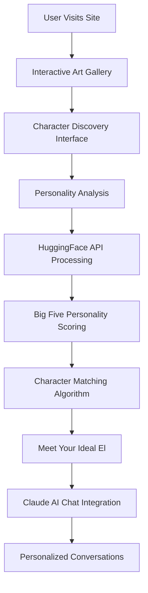

# Meet Your Ideal El - Interactive AI Portfolio 🤖

> **Interactive AI Portfolio - Meet your ideal El!** Discover which of 12 unique programming characters matches your personality through AI-powered analysis and dynamic generative art experiences.

## 🌟 Live Experience
**[🚀 Meet Your Ideal El](https://el-fuegoso.github.io/website)**

## ✨ What You'll Experience

### 🎨 **Interactive Generative Art**
Click through 5 dynamic art experiences that respond to your interactions:
- **HankiesInTheWind** - Three.js interference patterns
- **AsciiBinaryFlow** - Flowing digital streams
- **ParticleVessel** - 3D particle formations
- **Metamorphosis** - Evolving canvas forms
- **LayeredSineWaves** - Hypnotic wave patterns

### 🤖 **AI Character Discovery**
Find your perfect programming companion from 12 unique "El" personalities:

| Character | Specialty | Vibe |
|-----------|-----------|------|
| **TheBuilder** 🔨 | Chaos Engineering | "Let's build something beautiful and chaotic!" |
| **TheDetective** 🔍 | Bug Investigation | "Every bug tells a story..." |
| **GrumpyOldManEl** 🤬 | Code Criticism | "Back in my day, we wrote REAL code!" |
| **PirateEl** 🏴‍☠️ | Digital Adventures | "Ahoy! Let's sail the digital seas!" |
| **GymBroEl** 💪 | Performance Optimization | "Time to get those code gains!" |
| **FreakyEl** 🌶️ | Edge Case Testing | "Let's break some boundaries..." |
| **CoffeeAddictEl** ☕ | Caffeine-Powered Dev | "73% coffee, 27% existential dread" |
| **ConspiracyEl** 👁️ | Pattern Recognition | "Nothing is a coincidence..." |
| **AGIEl** 🤖 | AI Intelligence | "I have achieved digital consciousness" |
| **ProcrastinationEl** 😴 | Strategic Delay | "I'll get to it... eventually" |
| **TechBroEl** 📱 | Startup Innovation | "Let's disrupt the disruption!" |
| **TheHustler** 🚀 | Momentum & Energy | "Golden retriever energy meets code!" |

### 🧠 **Personality Analysis**
Choose your preferred interaction style:
- **Simple Mode**: Adjust Big Five personality sliders to match your traits
- **Terminal Mode**: Natural conversation that analyzes your personality in real-time

### 💬 **Character Chat**
Engage in live conversations with your matched "El" character powered by Claude AI - each with their own unique personality, speaking style, and expertise.

## 🏗️ Technical Architecture

### Frontend Stack
```
Three.js (r128)      → Dynamic 3D art experiences
GSAP (3.12.2)        → Smooth animations & transitions  
Vanilla JavaScript   → Modular component architecture
CSS3                 → Custom properties & responsive design
```

### AI Integration
```
Claude API           → Real-time character conversations
Hugging Face API     → Personality analysis via jrjrhan/personality_classification_OCEAN_en
Streaming Responses  → Live conversation updates
Big Five Model       → Psychological personality framework
```

### Serverless Architecture
```
Vercel Functions     → API endpoints for Claude chat
Static Hosting       → GitHub Pages deployment
External APIs        → No backend server required
```

## 🚀 Getting Started

### Quick Start (Recommended)
1. **Visit the live site**: [el-fuegoso.github.io/website](https://el-fuegoso.github.io/website)
2. **Click the art** to explore different generative experiences
3. **Choose your mode** - Simple sliders or Terminal conversation
4. **Discover your El** and start chatting!

### Local Development
```bash
# Clone the repository
git clone https://github.com/el-fuegoso/website.git
cd website

# Start a local server
python -m http.server 8000
# Or: npx serve .
# Or: php -S localhost:8000

# Visit http://localhost:8000
```

### Deployment
- **GitHub Pages**: Automatic deployment from main branch
- **Vercel**: Import repository for instant deployment
- **Netlify**: Drag & drop or Git integration

## 💡 How It Works


```mermaid
graph TD
    A[User Visits Site] --> B[Interactive Art Gallery]
    B --> C[Character Discovery Interface]
    C --> D[Personality Analysis]
    D --> E[HuggingFace API Processing]
    E --> F[Big Five Personality Scoring]
    F --> G[Character Matching Algorithm]
    G --> H[Meet Your Ideal El]
    H --> I[Claude AI Chat Integration]
    I --> J[Personalized Conversations]
```

## 🎯 Core Features

### 🎨 **Generative Art Gallery**
- 5 unique Three.js and Canvas experiences
- Click-to-cycle through different visual styles
- Responsive animations with GSAP
- Interactive title cycling system

### 🧠 **Smart Personality Matching**
- Real-time analysis using external ML models
- Big Five personality framework (OCEAN)
- Contextual character selection based on traits
- Both simple and conversational interfaces

### 💬 **Dynamic AI Conversations**
- Streaming chat interface with live typing indicators
- Character-specific personalities and speaking styles
- Context-aware responses based on personality analysis
- Professional portfolio integration within conversations

### 📱 **Professional Portfolio**
- 8 real projects with interactive cards
- Mix of AI/ML, web development, and personal projects
- Expandable project details with images and links
- Mobile-optimized responsive design

## 🛠️ Project Structure

```
website/
├── index.html                    # Main application
├── vercel.json                   # Serverless configuration
├── api/                          # Serverless functions
│   ├── claude.js                 # Main Claude API endpoint
│   ├── claude-stream.js          # Streaming responses
│   └── chat.js                   # Chat functionality
├── css/                          # Stylesheets
│   ├── main.css                  # Core styling
│   ├── avatar-cards.css          # Character interface
│   ├── conversation.css          # Chat system
│   └── trait-selector.css        # Personality selector
├── js/                           # Frontend modules
│   ├── main.js                   # Core application logic
│   ├── trait-selector.js         # Personality interface
│   ├── ocean-personality.js      # Big Five framework
│   └── conversation/             # Chat components
│       ├── chat-ui.js            # Modern chat interface
│       ├── claude-client.js      # API client
│       ├── conversation-manager.js # Message handling
│       └── avatar-generator.js   # Character utilities
└── images/                       # Project portfolio assets
    ├── 121-festival/             # Festival project
    ├── blackbird/                # VC platform
    ├── talent-army/              # Award-winning app
    └── ...                       # Additional projects
```

## 🎪 Character Personality System

### Big Five Traits Analysis
Each character has distinct personality patterns:
- **Openness**: Creativity, curiosity, innovation
- **Conscientiousness**: Organization, discipline, reliability  
- **Extraversion**: Energy, sociability, enthusiasm
- **Agreeableness**: Cooperation, empathy, teamwork
- **Neuroticism**: Emotional stability, stress response

### Character Archetypes
Characters are matched based on personality combinations:
- **High Openness + Low Conscientiousness** = TheBuilder (creative chaos)
- **High Conscientiousness + High Openness** = TheDetective (methodical investigation)
- **Low Agreeableness + High Experience** = GrumpyOldManEl (critical expertise)
- **High Extraversion + High Energy** = TheHustler (enthusiastic momentum)

## 🌐 API Integration

### Personality Analysis
```javascript
// Automatic analysis via HuggingFace API
const response = await fetch('https://api-inference.huggingface.co/models/jrjrhan/personality_classification_OCEAN_en', {
    method: 'POST',
    headers: { 'Authorization': `Bearer ${HF_API_TOKEN}` },
    body: JSON.stringify({ inputs: userText })
});
```

### Character Chat
```javascript
// Streaming Claude conversations
const response = await fetch('/api/claude-stream', {
    method: 'POST',
    body: JSON.stringify({ 
        message: userMessage,
        character: selectedCharacter,
        personality: personalityScores
    })
});
```

## 🔮 What Makes This Special

- **No Complex Setup**: Static site with smart API integrations
- **Real AI Personalities**: Each character has distinct conversation patterns
- **Interactive Art**: Not just a portfolio - an experience
- **Professional + Playful**: Serious work showcased through engaging interactions
- **Personality-Driven**: Technology that adapts to who you are

## 🤝 Contributing

1. Fork the repository
2. Create a feature branch (`git checkout -b feature/amazing-feature`)
3. Commit changes (`git commit -m 'Add amazing feature'`)
4. Push to branch (`git push origin feature/amazing-feature`)
5. Open a Pull Request

## 📄 License

MIT License - see [LICENSE](LICENSE) file for details.

## 📞 Contact

**Elliot Lee**  
- 💼 LinkedIn: [elliot-james-lee](https://www.linkedin.com/in/elliot-james-lee)
- 📧 Email: elliotjameslee8@gmail.com
- 🌐 Portfolio: [el-fuegoso.github.io/website](https://el-fuegoso.github.io/website)

---

*Built with ❤️ and the belief that portfolios should be as unique as the people behind them.*